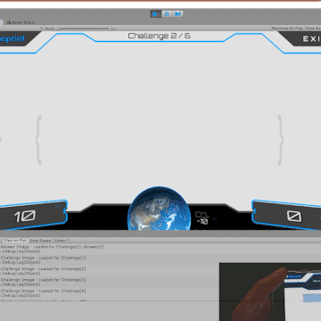
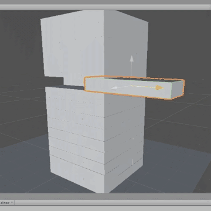

# legacy-gamedev
Unity game projects spanning my game development journey.

***Disclaimer: All content in this repository dates back significantly and should not be taken as a representation of my current expertise or adherence to best practices.***

## [ALTERIT](game-ALTERIT-demo)

### A 2D multiplatform ability-based game 

[Full demo on Youtube](https://www.youtube.com/watch?v=LH0LfCJr0ig)

An advanced multiplatform 2D game demo centered around ability-based mechanics, showcasing a variety of sophisticated systems that I built. Some of these include: custom touch controls, an automated level builder, numerous code-animated graphical effects, etc. 

Full details in [game-ALTERIT-demo/README](game-ALTERIT-demo/README.md).

## [USER TRAINER GAME](game-user-trainer-app)
### Developed for a printer management software company to train their users

[Full demo on Youtube](https://www.youtube.com/watch?v=f5lQgx0ibeI)

A game I developed for a printer management software company, designed to train users in an engaging 'Who Wants to Be a Millionaire'-style format. Given a tight two-week development window and my unfamiliarity with traditional Unity animation tools at the time, every visual element in the interface was [animated entirely through code](Assets/Scripts/GameController.cs). This approach not only ensured timely completion but also posed a unique and rewarding challenge for myself.

Full details in [game-user-trainer-demo-app/README](game-user-trainer-demo-app/README.md).

## [OMICRON](game-OMICRON-prototype)
### A 2D platformer based on electromagnetism's physics

A 2D platformer prototype that I developed where players control a ball. The ball's behaviour is a direct physical simulation, with forces calculated using actual electromagnetic field equations. Players can toggle the ball's charge, influencing its attraction or repulsion to platforms. Gamepad controls are supported.

[Full demo on Youtube](https://www.youtube.com/watch?v=H2EMbUft0Cw)

## [JENGA](prototype-JENGA)
### A prototype to understand materials

[Full demo on Youtube](https://www.youtube.com/watch?v=ZvYWhK3wTY4)

A prototype I built to play around with Unity physics and materials. This implementation features an automatic tower builder, utilising Unity's physics engine to simulate block interactions. Designed for experimentation with different material adjustments to fine-tune block behaviour to test the stability of different configurations.

## [FPS Mechanics Sandbox](prototype-FPS)

[Full demo on Youtube](https://www.youtube.com/watch?v=RHgiHEW1tIM)

A prototype I built to explore implementing first-person view shooter dynamics: controls and camera, foundational AI for enemy interactions, raycasting-based shooting mechanics, etc.