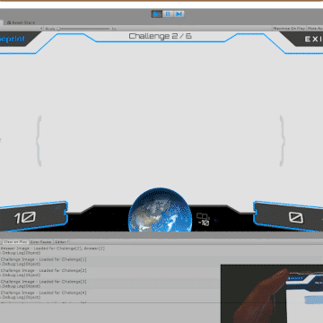

# USER TRAINER GAME

## Developed for printer management software company to train their users

[Full demo on Youtube](https://www.youtube.com/watch?v=f5lQgx0ibeI)

A game I developed for a printer management software company, designed to train users in a fun, 'Who Wants to Be a Millionaire'-style format. Due to the tight one-week development timeframe, there wasn't an opportunity to delve into traditional Unity animation tools. However, leveraging my abitities at the time, every visual element—from the interactive interface to the dynamic score displays—was animated purely through code. This approach not only met the deadline but also made the project an interesting challenge for myself.