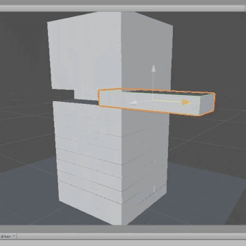

# JENGA 

## A prototype to understand materials

[Full demo on Youtube](https://www.youtube.com/watch?v=ZvYWhK3wTY4)

A prototype I built to play around with Unity physics and materials. This implementation features an automatic tower builder, utilizing Unity's physics engine to simulate block interactions. Designed for experimentation with different material adjustments to fine-tune block behavior to test the stability of different configurations.
